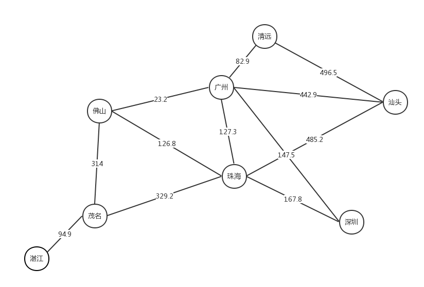

# 迪杰斯特拉算法（Dijkstra）

迪杰斯特拉算法是由荷兰计算机科学家狄克斯特拉于1959 年提出的，该算法是以“贪心算法（greedy algorithm）”设计的，是根据子路径的最优解来计算全路径的最优解。

图片来自[WIKIPEDIA](https://en.wikipedia.org/wiki/Dijkstra%27s_algorithm)

#### dijkstra.py中测试图

